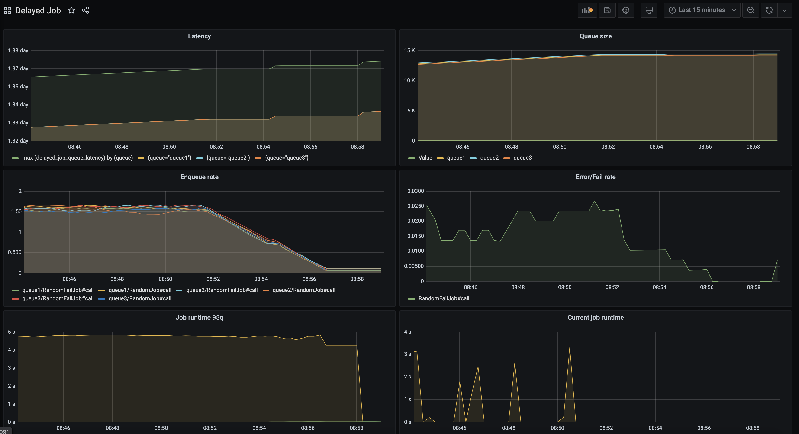

# Yabeda::DelayedJob

Built-in metrics for [DelayedJob](https://github.com/collectiveidea/delayed_job) background workers monitoring out of the box! Part of the [yabeda](https://github.com/yabeda-rb/yabeda) suite.


## Metrics

Works as the DelayedJjob plugin and provides following metrics:
 - `jobs_enqueued_total` - the counter of enqueued jobs (segmented by queue/worker)
 - `jobs_failed_total`/`jobs_errored_total` - the counter of failed/errored jobs (segmented by queue/worker/error)
 - `jobs_waiting_count` - the number of jobs are waited for execution, queue size (segmented by queue).
 - `queue_latency` - the queue latency - difference in seconds since the oldest job was enqueued (segmented by queue)
 - `job_runtime` - the histogram of job running time (in seconds, segmented by queue, worker)
 - `running_job_runtime` - the running time of currently executed job (segmented by queue, worker). Helps to determine long running jobs.

## Details

Example of predefined Grafana dashboard.


.


## Installation

Add this line to your application's Gemfile:

```ruby
gem 'yabeda-delayed_job'
```

And then execute:

    $ bundle

Or install it yourself as:

    $ gem install yabeda-delayed_job

## Usage

### Collecting metrics

Start metrics exporter to you delayed_job startup script (`script/delayed_job`). In case you do not have Rails loaded configure Yabeda first:

```ruby
::Yabeda.configure!
::Yabeda::Prometheus::Exporter.start_metrics_server!
```

## Development with Docker

Get local development environment working and tests running is very easy with docker-compose:
```bash
docker-compose run app bundle
docker-compose run app bundle exec rspec
```

## Contributing

Bug reports and pull requests are welcome on GitHub at https://github.com/dsalahutdinov/yabeda-delayed_job. This project is intended to be a safe, welcoming space for collaboration, and contributors are expected to adhere to the [Contributor Covenant](http://contributor-covenant.org) code of conduct.

## License

The gem is available as open source under the terms of the [MIT License](https://opensource.org/licenses/MIT).

## Code of Conduct

Everyone interacting in the Yabeda::DelayedJob project’s codebases, issue trackers, chat rooms and mailing lists is expected to follow the [code of conduct](https://github.com/[USERNAME]/yabeda-delayed_job/blob/master/CODE_OF_CONDUCT.md).
